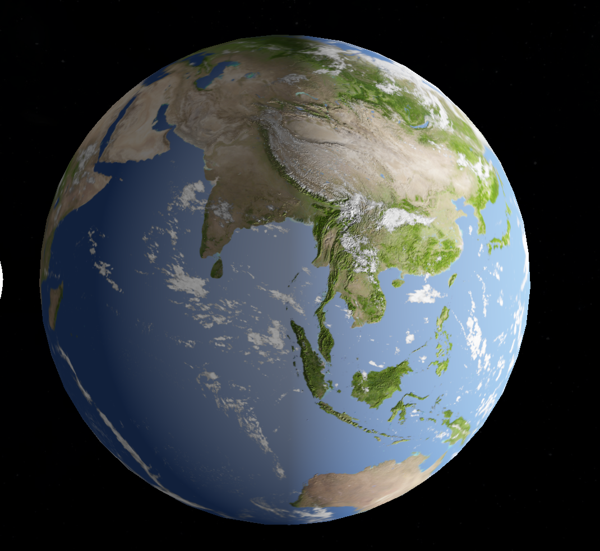
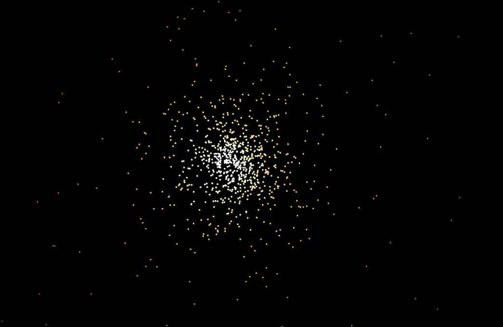
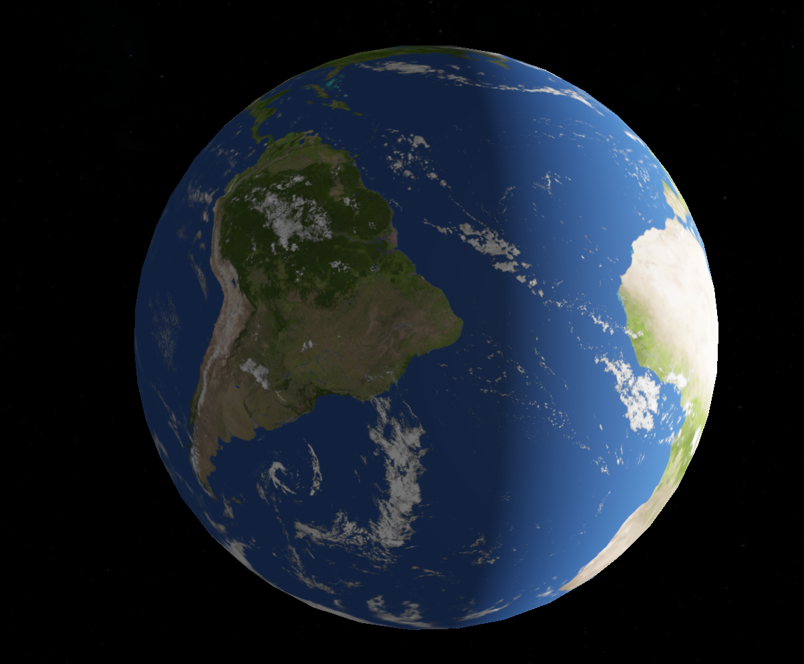
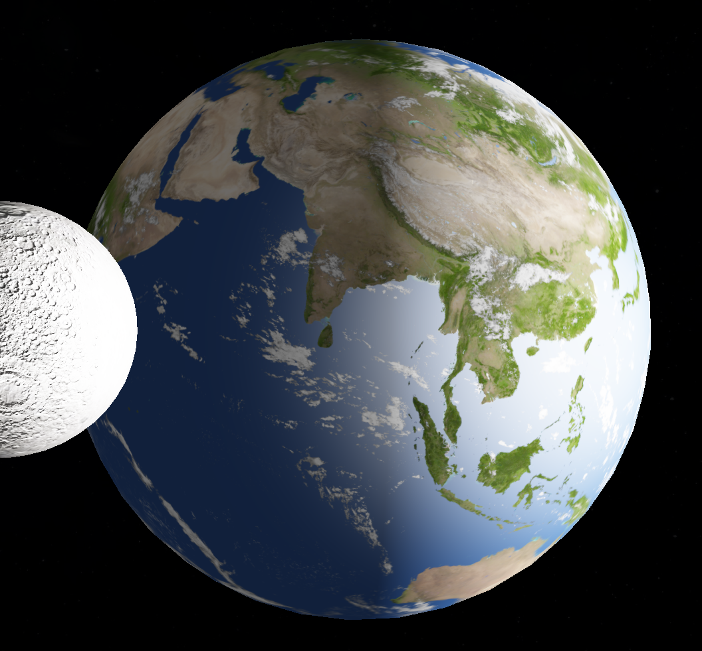
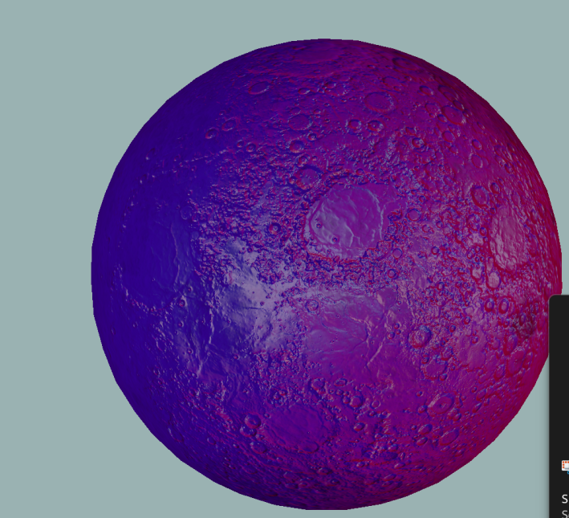
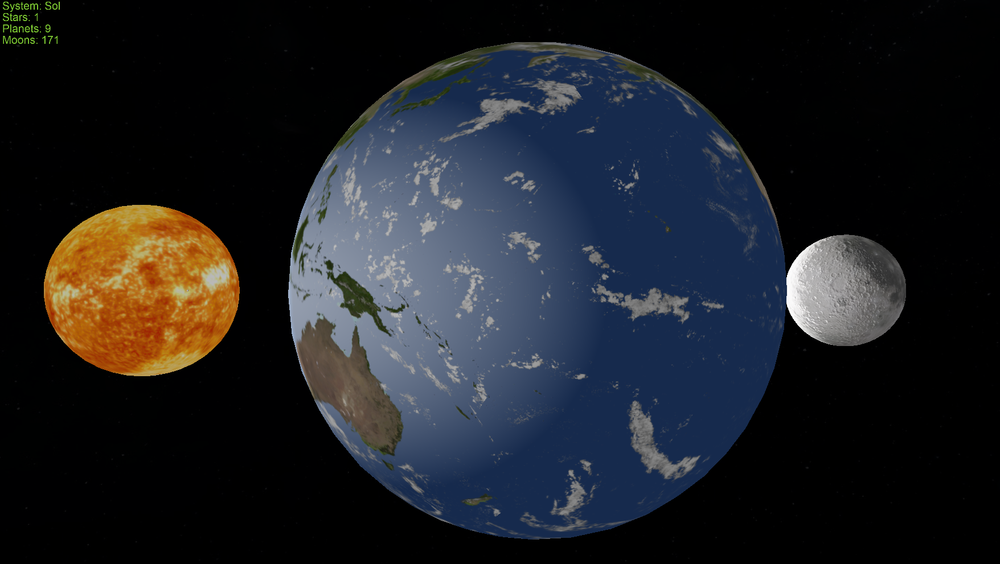

# SolarSystemSimulator

[Link to Repository](https://github.com/haroonsyed/SolarSystemSimulator)

## Made in CAP4730: Computer Graphics at the University of Florida

### Under Dr. Aleirza Entezari



### Features

### Technologies Used

- GLFW
- OPENGL
- VCPKG
- GLM
- C++
- Fundamentals of Computer Graphics 3rd Edition
- WSL2
- CMAKE
- Nodejs
- nlohmann-json
- freetype

### Compilation Instructions

**Windows**

1. Clone this repo using <br>
   `git clone https://github.com/haroonsyed/SolarSystemSimulator.git --recursive`
2. Install cmake
3. Open the folder containing repo in visual studio, run main.cpp

   or

4. CD into build folder and run `cmake ..`
5. Open generated solution (in build folder) in visual studio and run main.cpp

**Linux**

1. Clone this repo using <br>
   `git clone https://github.com/haroonsyed/SolarSystemSimulator.git --recursive`
2. Install the following dependencies:
   libxmu-dev libxi-dev libgl-dev libxinerama-dev libxcursor-dev xorg-dev libglu1-mesa-dev
3. Install cmake
4. CD into build folder and run `cmake ..`
5. Run `make` to build your executable
6. Run `./main`

**Apple**
Probably works but I don't own a mac to test. Also the cmake script does not install mac-specific binaries.

### Operation Guide

`Left Click & Drag`:<br>
&nbsp;&nbsp;&nbsp;&nbsp;&nbsp;&nbsp;Pan the screen when in top-down view of all the solar system.<br>
`Press Q`:<br>
&nbsp;&nbsp;&nbsp;&nbsp;&nbsp;&nbsp;Cycles focus between gravity bodies within the view.<br>
`Press Z`:<br>
&nbsp;&nbsp;&nbsp;&nbsp;&nbsp;&nbsp; To zoom in<br>
`Press X`: <br>
&nbsp;&nbsp;&nbsp;&nbsp;&nbsp;&nbsp; To zoom out<br>
`Press G`:<br>
&nbsp;&nbsp;&nbsp;&nbsp;&nbsp;&nbsp; To toggle gui and disconnect mouse from window.<br>

## Functionality

# Physics System

The first thing I worked on was the physics system. It is pretty inefficient currently, performing an O(n^2) n-body calculation over all planets. I planned to upgrade this system to use compute shaders with a barnes-hut quad-tree to have realtime simulation of galaxys.
<br><br>
Newtonial Calculation:

## F = G * (M1*M2) / dot(distance, distance)<br>

## a = F/M ; <br>

## vf = vi + at; <br>

## pos' = pos + vf \* deltaT<br><br>

Due to how large the numbers are, I quickly ran against the limit of floating point numbers. The simple solution was to perform calculations with scaled units.

<br>
I also realized that I needed to decouple the physics system from the framerate of the application. In order to do this I use the delta time between frames to calculate the amount of distance (as seen above). This also enabled variable speed of the simulation by changing multiplier. <br><br>

#### Galaxy Generator Tool

Uses javascript to randomly place stars in the system. Will be expanded to support movement and more complicated shapes.

### Defining Scenes

It was quite annoying to hard code all these values and update them. So I decided to write the configuration of a system to json which can be read at startup.

I chose to write in JSON, which has the following general format.

```
{
  "PhysicsDistanceFactor": 1e6,
  "PhysicsMassFactor": 1e6,
  "UniverseScaleFactor": 10,
  "CameraPosition": {x: ,y: ,z: },
  "GravBodies": [
    {
      "name": "Earth",
      "radius": 6378e3,
      "mass": 5.97e24,
      "position": {x: ,y: ,z: },
      "velocity": {x: ,y: ,z: },
      "tilt": 23.44,
      "rotationPeriod": 23.9345,
      "meshFilePath": "../assets/models/sphere.obj",
      "vertexShaderPath": "../assets/shaders/testing.vs",
      "fragmentShaderPath": "../assets/shaders/testing.fs",
      "diffuseMap": "../assets/textures/earth_diffuse_day.jpg",
      "specularMap": "../assets/textures/earth_specular.jpg",
      "normalMap": "../assets/textures/earth_normal.png",
	  "cloudMap": "../assets/textures/fair_clouds_8k.jpg"
    }

  ],
  "Lights": [
    {
        "position": {
            "x": 0.0,
            "y": 0.0,
            "z": 0.0
        },
        "color": {
            "red": 1.0,
            "green": 1.0,
            "blue": 1.0
        },
        "intensity": 50.0
    }
  ]
}
```

<br><br>

### Rendering pipeline

The rendering pipeline was completely overhauled from the view project. I needed the flexibilty to bind different meshes, textures and shaders at runtime. For this reason I created singleton managers for each with caching of the relevant VAO/VBO.

<br>
I also implemented instanced rendering and grouping objects into a tree structure based on matching mesh and material. This was necessary before my plans to overhaul the physics system for galaxy-level simulaton.<br>
<br>In the future I want to also implement something called bindless textures to increase performance and flexibility further. <br>
<br>The instanced rendering, while more performant than individual draw calls is severely less efficient than I hoped it would be, only able to draw 10k objects on my GTX1070 before fps becomes poor. I plan on using nvidia nsight to debug this.<br><br>


This example has a couple thousand stars (with physics disabled) and runs okay with instancing. But any further and fps goes too low.

### Textures

The defaultShader has support for diffuse, normal, specular maps. Custom shaders can also be created that make use of other texture units.

#### Diffuse:

<br>

#### Specular:



Here I turned up the specular coefficient so it is more obvious that water areas experience more specular highlights. In the future I want to add noise to the water to breaks up the specular, maybe with depth based coloring with bathymetric maps.<br>

#### Normal Earth:


Even though atmospheric scattering was not implemented, the Earth is still so pretty. You can see the normal acting strongly on the himilaya region. The moon has the most detailed normal map, and also looks great.

#### Normal map tool

Diffuse maps from NASA were in a png/jpg format easily usable. And while specular maps are not needed for planets to look good, normal maps are absolutely necessary. Unfortunately these are not readily availble, since NASA releases depth maps of the planet. For this purpose I created a nodejs tool to run a sobel filter and extract edges where depth changes quickly to make a normal map. This can be found in `util/topoToNormal`.

### Movement

The physics system determines the movement of the planets, but there is also a tilt and rotation period defined in the JSON documents that define how a planets should spin. For this I used quaternions. The trigonometry that defined the axis based on the tilt (converted to radians) is below.

```
  glm::vec3 axis(
    -glm::sin(tiltRadians),
    0.0,
    glm::cos(tiltRadians)
  );
  m_axis = glm::normalize(axis);
```

### Lighting

I probably spent too much time on the lighting system considering that the sun is the only real source of light. However the pipeline supports multiple lights and colors.


Here a blue and red light are placed on either side of the moon.


This is the default lighting, although specular is a bit high right now from the previous example.

All lights are currently point lights.

#### Automatic Exposure HDR and Bloom

In order to add bloom, the program uses HDR. However I could not get the gaussian blur to happen fast enough. I realize I have to make separable passes, but I felt having multiple frame buffers to ping-pong between would be slow as well.

<br>

I used a lot of time writing an automatic exposure system in order for planets far away to be lit up correctly. I could disable light falloff, but then all planets would be equally bright and bloom would not have a proper threshold to go over. I suppose I could use the emissive map for this purpose as well though.

The automatic exposure works by using the lowest mipmap to find the average brightness of the scene (which has its problems). In order to stop flickering, this value is lerped between frames, which increases temporal stability. What was amazing with this system is seeing an eclipse as a planet when infront of the sun and went completely black. I would have an example but I'm running out of time to submit the report.

<br>

## Videos

Coming soon

## Issues

- The gas planets wobble because their texture is misaligned compared to their axis of rotation
- Automatic exposure does not work perfectly since it takes average of whole scene instead of the focused object.
- There is banding on planets sometimes, even though I am using a 32 bit rgba buffer. Requires further investigation.
- Instancing is not as fast as I would have hoped. Will look into more with tools like nvidia insight.

## Outside Help

## Assignment Requriements Checklist (Part 1):

| Feature                                              | Status             | Extra Desc.                                                                                                                             |
| ---------------------------------------------------- | ------------------ | --------------------------------------------------------------------------------------------------------------------------------------- |
| Have all planets in a physics system                 | :white_check_mark: |                                                                                                                                         |
| Diffuse, Specular, Normal maps                       | :white_check_mark: |                                                                                                                                         |
| Multi-Light system                                   | :white_check_mark: |                                                                                                                                         |
| User interaction                                     | :white_check_mark: |                                                                                                                                         |
| Bloom                                                | :x:                | I did implement automatic exposure and HDR. I have a bloom implementation, but it is extremely slow because of its naive implementation |
| Atmospheric Scattering                               | :x:                |                                                                                                                                         |
| User interaction                                     | :white_check_mark: |
| NBody Simlualtion using compute shader and quad-tree | :x:                |
|                                                      |

## DISCLAIMER

THIS IS ONLY FOR SUBMISSION/DEMONSTRATION PURPOSES AND IS NOT FOR OTHER STUDENTS TAKING THE CLASS.

I DO NOT AUTHORIZE THE USE OF THIS CODE FOR CLASS PURPOSES BY ANY STUDENT OTHER THAN THOSE IN THIS GROUP OR IN ANY FORM THAT WOULD BE CONSIDERED "CHEATING" OR "PLAGARISM".

Please be ethical.
